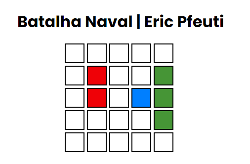

# BATALHA NAVAL em JAVASCRIPT

  

<h4>Feito com JavaScript, o código apenas contém o tabuleiro da batalha naval e alguns barcos que ao apertar "F5"/atualizar página eles vão mudando de posição aleatoriamente, em breve o jogo será realizado...</h4>

## Linguagens Utilizadas:

   
  
    

